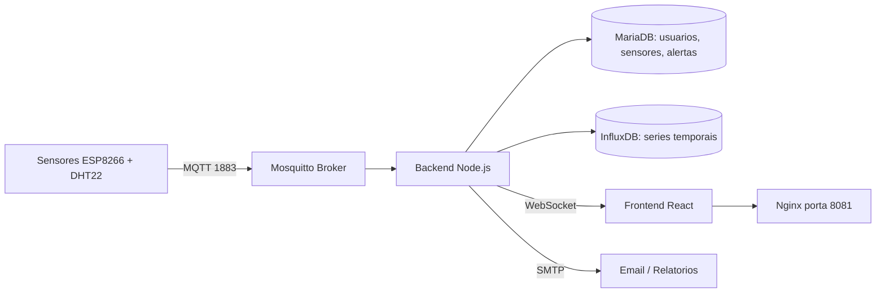

# TH-GUARD — Plataforma de Monitoramento Ambiental

Sistema completo de monitoramento de temperatura e umidade com ESP8266 + DHT22, backend Node.js, frontend React e banco de dados MariaDB + InfluxDB.

## Arquitetura



## Stack

- **Firmware:** ESP8266 (NodeMCU 1.0) + DHT22
- **Broker:** Eclipse Mosquitto 2 (MQTT)
- **Backend:** Node.js + Express + WebSocket
- **Frontend:** React + Vite
- **Banco de dados:** MariaDB 11 + InfluxDB 2
- **Proxy:** Nginx
- **Containerização:** Docker + Docker Compose

## Funcionalidades

- Registro automático de sensores por endereço MAC
- Dashboard em tempo real via WebSocket
- Gráficos históricos com múltiplos ranges (1h, 6h, 24h, 7d)
- Alertas por email (temperatura alta, umidade alta, sensor offline)
- Relatórios diário/semanal/mensal com CSV anexo
- Controle de acesso por roles (admin, editor, viewer)
- Autenticação MQTT por usuário/senha com controle de ACL por tópico
- Interface responsiva (desktop e mobile)

## Pré-requisitos

- Docker e Docker Compose
- Arduino IDE 2.x com suporte ESP8266 e/ou ESP32
- Bibliotecas Arduino: DHT, PubSubClient, Adafruit GFX, Adafruit SSD1306, NTPClient

## Instalação

### 1 — Clone o repositório

```bash
git clone https://github.com/SeulRKSantos/Sensor-de-Temperatura-inteligente.git
cd Sensor-de-Temperatura-inteligente/thguard
```

### 2 — Configure as variáveis de ambiente

```bash
cp .env.example .env
# Edite o .env com suas credenciais
nano .env
```

> **Atenção:** `ALLOWED_ORIGINS` deve conter o endereço pelo qual o painel será
> acessado (ex: `http://localhost:8081` ou `http://10.10.0.209:8081`).
> Se a origem não estiver na lista, o login retorna **erro 500**.

### 3 — Configure o Mosquitto

```bash
# Crie o arquivo de senhas do broker
docker run --rm -v $(pwd)/mosquitto/config:/mosquitto/config \
  --user root eclipse-mosquitto:2 \
  mosquitto_passwd -c -b /mosquitto/config/passwd thguard SUA_SENHA

docker run --rm -v $(pwd)/mosquitto/config:/mosquitto/config \
  --user root eclipse-mosquitto:2 \
  mosquitto_passwd -b /mosquitto/config/passwd thguard-backend SUA_SENHA_BACKEND
```

### 4 — Suba os containers

```bash
docker compose up -d
```

### 5 — Acesse o painel
http://localhost:8081
Login: admin@thguard.local / ***REMOVED***
> ⚠️ Troque a senha padrão após o primeiro acesso em **Usuários → Administrador**.

## Firmware

Sketches disponíveis:

| Pasta | Placa | Uso |
|---|---|---|
| `firmware/thguard_v4_mac/` | ESP8266 (NodeMCU) | Firmware universal — registro por MAC |
| `firmware/thguard_v4_local/` | ESP8266 (NodeMCU) | Versão simplificada |
| `firmware/thguard_esp32/` | ESP32 DevKit | Port do v4 — mesmo protocolo MQTT |

Todos usam o mesmo protocolo: o sensor publica seu MAC em `thguard/register` e o
servidor responde em `thguard/<MAC>/config` com o `sensor_id` atribuído.

**Pinagem ESP32:** DHT22 `GPIO4` · OLED `GPIO21/22` (I2C) · LEDs `GPIO25/26` · Botão reset `GPIO27`.
**Pinagem ESP8266:** DHT22 `GPIO2` · OLED `GPIO5/4` · LEDs `GPIO14/13` · Botão reset `GPIO0`.

### Configuração

Cada sketch precisa de um arquivo secrets.h com as credenciais do broker MQTT.
Esse arquivo não é versionado (gitignored). Antes de compilar, copie o exemplo:

```bash
cd firmware/thguard_v4_mac
cp secrets.h.example secrets.h
```

Edite secrets.h com as credenciais do seu broker:

```cpp
#pragma once
#define MQTT_USER "thguard"
#define MQTT_PASS "TROQUE_AQUI"
```

### Upload

1. Abra `firmware/thguard_v4_mac/thguard_v4_mac.ino` no Arduino IDE
2. Selecione: `Tools → Board → NodeMCU 1.0 (ESP-12E Module)`
3. Selecione: `Tools → Flash Size → 4MB (FS:2MB OTA:-1019KB)`
4. Grave o firmware: `Ctrl+U`
5. Configure WiFi e IP do servidor via painel web do sensor (`http://IP_DO_SENSOR`)

## Estrutura do projeto

```text
thguard/
├── backend/              ← API Node.js + serviços
│   └── src/
│       ├── models/       ← MariaDB (db.js, migrate.js)
│       ├── routes/       ← auth, sensors, alerts, users
│       └── services/     ← mqtt, influx, email, alertManager
├── frontend/             ← React + Vite
│   └── src/
│       ├── pages/        ← Dashboard, Sensores, Alertas, Relatórios
│       └── components/   ← Layout, navegação
├── firmware/             ← Firmware ESP8266
├── mariadb/              ← Schema SQL inicial
├── mosquitto/config/     ← Configuração do broker MQTT
├── nginx/                ← Configuração do proxy reverso
├── .env.example          ← Variáveis de ambiente necessárias
└── docker-compose.yml    ← Stack completa
```

## Licença

MIT
